<a id="top"></a>

<div align="center">


# 🎬 Auto News Video

### Turn any Vietnamese tech article into a TikTok-ready video in 60 seconds

**One command. Zero editing. Studio-quality 9:16 motion graphics.**

[](https://github.com/hoquanghai/Auto-Create-Video/stargazers)
[](https://github.com/hoquanghai/Auto-Create-Video/network/members)
[](LICENSE)
[](https://nodejs.org)
[](https://www.typescriptlang.org/)
[](https://github.com/hoquanghai/Auto-Create-Video/actions/workflows/test.yml)
[](https://github.com/hoquanghai/Auto-Create-Video/actions/workflows/typecheck.yml)

[**🇬🇧 English**](README.md) · [**🇻🇳 Tiếng Việt**](README.vi.md) · [**📺 Watch Demo**](https://youtube.com/shorts/S24JfKxV4bo) · [**🚀 Quick Start**](#-quick-start) · [**❓ FAQ**](#-faq)

</div>

---

<div align="center">

## 🎥 Live Demo

### 👉 [**▶️ Watch on YouTube Shorts**](https://youtube.com/shorts/S24JfKxV4bo) 👈

[](https://youtube.com/shorts/S24JfKxV4bo)

[](https://youtube.com/shorts/S24JfKxV4bo)

*This video was generated **entirely** by this pipeline — Vietnamese TTS + HyperFrames + GSAP animations, no manual editing.*

</div>

---

## 🤔 Why does this exist?

Creating short-form news videos is **time-consuming and repetitive**:

- ⏰ Manually scripting → 30 min per video
- 🎨 Picking visuals + animations → 1 hour per video
- 🎙️ Recording or sourcing voiceover → 30 min
- ✂️ Editing in CapCut / Premiere → 1 hour
- 📱 **Total: ~3 hours per 60-second video**

**Auto News Video does it in 5 minutes. Just paste a URL.**

| | Manual workflow | Auto News Video |
|---|---|---|
| ⏱️ Time per video | ~3 hours | **~5 minutes** |
| 🎓 Skill required | Video editor | **None** |
| 🎯 Consistency | Varies | **Studio-grade every time** |
| 💰 Cost per video | $50–200 (freelancer) | **~$0.10 (API costs)** |
| 🇻🇳 Vietnamese voice | Hard to source | **Built-in (LucyLab cloning)** |

---

## 🚀 Quick Start

```bash
# 1. Clone & install
git clone https://github.com/hoquanghai/Auto-Create-Video.git
cd Auto-Create-Video
npm install

# 2. Configure TTS API key
cp .env.example .env.local
# → edit .env.local, set TTS_PROVIDER + key (LucyLab or ElevenLabs)
```

Then choose your path:

**Path A — With Claude Code (recommended, 30 seconds setup):**

1. Install Claude Code: `npm install -g @anthropic-ai/claude-code`
2. Inside the project directory, run `claude`, then type:
   ```
   /create-news-video https://vnexpress.net/some-article
   ```

**Path B — Without Claude Code (hand-write the script):**

```bash
# Edit script.json manually based on src/render/script-schema.ts
npm run pipeline -- output/my-video/script.json
```

Either way, after ~3–5 minutes you'll have `output/<slug>/video.mp4` — a 1080×1920 MP4 ready for TikTok / Shorts / Reels.

> 💡 **Need details?** Jump to [Full Setup](#-full-setup) · [Configuration](#-configuration) · [Usage](#-usage)

---

## ✨ Features

<table>
<tr>
<td width="33%" align="center">
<h3>🎨 12 Smart Templates</h3>
<sub>hook · comparison · stat-hero · feature-list · callout · outro · quote-card · icon-grid · timeline · big-text · chart-bars · kinetic-quote</sub>
</td>
<td width="33%" align="center">
<h3>🎤 Multi-TTS</h3>
<sub>LucyLab (Vietnamese cloning + free SRT) or ElevenLabs (30+ languages)</sub>
</td>
<td width="33%" align="center">
<h3>🤖 Claude Code Skill</h3>
<sub>One slash command:<br/><code>/create-news-video &lt;url&gt;</code><br/>(URL / .txt / .md input)</sub>
</td>
</tr>
<tr>
<td width="33%" align="center">
<h3>🎬 HeyGen-Quality Look</h3>
<sub>Studio shell + grain texture + GSAP animations + 6 theme palettes (tech-blue, growth-green, finance-gold, warning-red, creator-purple, news-mono)</sub>
</td>
<td width="33%" align="center">
<h3>🔊 Auto SFX Mixing</h3>
<sub>3-tier smart picker (override → semantic match → template default) with anti-repetition + anti-overlap guards</sub>
</td>
<td width="33%" align="center">
<h3>🧪 Production Ready</h3>
<sub>44 unit tests, Zod schema validation, full TypeScript ESM, GitHub Actions CI</sub>
</td>
</tr>
<tr>
<td width="33%" align="center">
<h3>📱 9:16 Native</h3>
<sub>1080×1920 @ 30fps, ready for TikTok / Shorts / Reels</sub>
</td>
<td width="33%" align="center">
<h3>♻️ Idempotent TTS</h3>
<sub>Skips re-synthesis if voice files exist — saves API quota across re-renders</sub>
</td>
<td width="33%" align="center">
<h3>🖼️ Auto Thumbnail</h3>
<sub>Gemini 2.5 Flash Image generates a 9:16 cover, embedded into MP4 (no re-encode)</sub>
</td>
</tr>
<tr>
<td width="33%" align="center">
<h3>🎯 Voice-Text Sync</h3>
<sub><code>voiceChunks</code> per scene → beats fire EXACTLY when voice mentions each element</sub>
</td>
<td width="33%" align="center">
<h3>✅ Quality Gates</h3>
<sub>Pre-render <code>lint</code> + <code>validate</code> (WCAG contrast) + <code>inspect</code> (text overflow / off-canvas)</sub>
</td>
<td width="33%" align="center">
<h3>📝 CapCut-Friendly</h3>
<sub>Exports <code>script.txt</code> + <code>voice.mp3</code> + <code>sns_post.txt</code> for auto-caption + social caption</sub>
</td>
</tr>
</table>

---

## 🧠 How It Works

```mermaid
flowchart LR
    A[📰 URL / .txt / .md] -->|/create-news-video| B[Claude Code]
    B -->|fetch + analyze| C[Generate script.json]
    C -->|Zod validate| D{Template Picker}
    D -->|12 variants| E[Scene Types]
    E -->|TTS per scene<br/>or per chunk| F[LucyLab / ElevenLabs]
    F -->|voice.mp3<br/>+ SFX mix<br/>+ beat SFX| G[HyperFrames]
    G -.->|lint<br/>validate<br/>inspect| G
    G -->|Puppeteer + GSAP| H[1800 frames @ 30fps]
    H -->|FFmpeg encode| I[video.mp4 1080×1920]
    I -->|attach cover| J[Gemini Thumbnail]
    J -->|🎬 video.mp4 + thumbnail.png| K[Done]

    style A fill:#0f172a,color:#fff
    style K fill:#10b981,color:#fff
    style B fill:#6366f1,color:#fff
    style F fill:#f59e0b,color:#fff
    style G fill:#ec4899,color:#fff
    style J fill:#8b5cf6,color:#fff
```



The pipeline is **AI for content** (Claude writes the script) and **deterministic code for production** (Node/TS/FFmpeg renders the pixels) — same input → identical frames every time.

---

## 🛠️ Tech Stack

| Layer | Technology |
|---|---|
| **Runtime** | Node.js ≥ 22, TypeScript 6+, ESM |
| **Render engine** | [HyperFrames](https://hyperframes.heygen.com) ^0.4.34 (Puppeteer + GSAP + FFmpeg) |
| **Quality gates** | `hyperframes lint` (errors block) → `validate` (WCAG contrast) → `inspect` (text overflow / off-canvas) — all run before render |
| **TTS providers** | [LucyLab.io](https://lucylab.io) (JSON-RPC async, Vietnamese cloning) or [ElevenLabs](https://elevenlabs.io) (REST sync, multilingual) |
| **Image generation** | [Gemini 2.5 Flash Image](https://aistudio.google.com) — 9:16 thumbnails, embedded as MP4 cover |
| **Schema validation** | [Zod](https://zod.dev) ^4 discriminated unions (12 template variants) |
| **HTTP** | axios ^1.15 + nock (test mocking) |
| **Concurrency** | [p-limit](https://github.com/sindresorhus/p-limit) ^7 (TTS rate-limiting per provider) |
| **Testing** | [Vitest](https://vitest.dev) ^4 — ESM-native, with @vitest/coverage-v8 |
| **Audio processing** | FFmpeg + ffprobe (mix, concat with silence, attach cover image) |
| **AI orchestration** | [Claude Code](https://docs.claude.com/en/docs/claude-code/overview) skill (`/create-news-video`) |
| **Visual blocks** | HyperFrames registry: `grain-overlay`, `shimmer-sweep`, `tiktok-follow` |
| **Brand spec** | See [`design.md`](design.md) — palette, layout density, motion principles |
| **Fonts** | Manrope (body) + Anton (display) + Lora (italic serif for quotes) — Google Fonts |

---

## 📋 Prerequisites

| Item | Version | Notes |
|---|---|---|
| **Node.js** | ≥ 22 | `node --version` |
| **FFmpeg + ffprobe** | any modern | must be in PATH (`ffmpeg -version`) |
| **Chrome / Chromium** | any | auto-downloaded by Puppeteer on first render |
| **Claude Code CLI** | latest | [install here](https://docs.claude.com/en/docs/claude-code/overview) |
| **TTS account** | one of two | LucyLab.io OR ElevenLabs |

---

## 🔧 Full Setup

```bash
# 1. Clone & enter
git clone https://github.com/hoquanghai/Auto-Create-Video.git
cd Auto-Create-Video

# 2. Install
npm install

# 3. Configure
cp .env.example .env.local
# → open .env.local, set TTS_PROVIDER + API key (see Configuration below)

# 4. Verify
node --version       # ≥ 22
ffmpeg -version      # any version OK
ffprobe -version
npm test             # 44 tests should pass
```

### Install FFmpeg

| OS | Command |
|---|---|
| **Windows** | `winget install Gyan.FFmpeg` |
| **macOS** | `brew install ffmpeg` |
| **Ubuntu/Debian** | `sudo apt install ffmpeg` |

---

## ⚙️ Configuration

Open `.env.local` and pick **one of two providers**:

### Option 1 — LucyLab.io (recommended for Vietnamese)

```env
TTS_PROVIDER=lucylab
VIETNAMESE_API_KEY=sk_live_xxxxxxxxxxxxxxxxxxxx
VIETNAMESE_VOICEID=22charvoiceiduuidhere
```

- ✅ Natural Vietnamese voice (cloning), free SRT subtitle file included
- ⚠️ Only 1 concurrent export per account (pipeline serialises automatically)
- 🔗 Sign up: https://lucylab.io

### Option 2 — ElevenLabs

```env
TTS_PROVIDER=elevenlabs
ELEVENLABS_API_KEY=sk_xxxxxxxxxxxxxxxxxxxxxxxxxxxxxxxxxxxxxxxxxxxxxxxx
ELEVENLABS_VOICE_ID=EXAVITQu4vr4xnSDxMaL
ELEVENLABS_MODEL_ID=eleven_multilingual_v2
```

- ✅ Multilingual (30+ languages), large voice library, high quality
- ⚠️ Pricier than LucyLab, no SRT included
- 🔗 Get key: https://elevenlabs.io/app/settings/api-keys · Browse voices: https://elevenlabs.io/app/voice-library

### TikTok follow card (optional, all defaults work)

```env
TIKTOK_DISPLAY_NAME=Quẹp Làm IT
TIKTOK_HANDLE=@haiquep
TIKTOK_FOLLOWERS=11.5k followers
TIKTOK_AVATAR_URL=https://example.com/your-avatar.jpg   # optional
```

To customise the avatar, either replace `assets/avatar.png` with your own square ≥256×256 image, **or** set `TIKTOK_AVATAR_URL` so the pipeline downloads it on every render.

### Option 3 — Gemini thumbnail (optional, gracefully skipped if absent)

If set, the pipeline generates a 9:16 thumbnail per video and embeds it as the MP4 cover image — Windows Explorer / Finder / TikTok / YouTube uploaders show it before any frame plays. Without a key, the step is silently skipped (video still renders).

```env
GEMINI_API_KEY=YOUR_GEMINI_API_KEY_HERE
GEMINI_IMAGE_MODEL=gemini-2.5-flash-image    # default; ~7s per call
```

🔗 Get a free key: https://aistudio.google.com/apikey

### Pipeline tuning (optional)

```env
TTS_CONCURRENCY=1    # 1 for LucyLab (API limit). Increase for ElevenLabs parallelism.
```

---

## 🎬 Usage

### Method 1 — Inside Claude Code (recommended)

Open Claude Code in the project directory and type:

```
/create-news-video https://vnexpress.net/iphone-17-200mp
```

Or with a local file (`.txt` or `.md`):

```
/create-news-video news/my-article.md
```

After ~3–5 minutes:

```
✓ Video:  output/<slug>-<timestamp>/video.mp4    ← final video
✓ Audio:  output/<slug>-<timestamp>/voice.mp3    ← for CapCut import
✓ Script: output/<slug>-<timestamp>/script.txt   ← for CapCut auto-caption
```

### Method 2 — Run pipeline directly (advanced)

If you already have a `script.json` (debugging or hand-written):

```bash
npm run pipeline -- output/<slug>-<timestamp>/script.json
```

### Method 3 — Re-render visuals only (saves TTS quota)

When voice files already exist in `voice/` and you only want to re-render the visuals:

```bash
npm run rerender -- output/<slug>-<timestamp>
```

---

## 📁 Output Structure

```
output/<slug>-<timestamp>/
├── script.json                # Input JSON (Claude-generated or hand-written)
├── script.txt                 # Plain text for CapCut auto-caption
├── sns_post.txt               # Vietnamese caption for TikTok / Reels (skill-generated)
├── images/bg.jpg              # og:image (if URL had one)
├── voice/
│   ├── scene-hook.mp3         # TTS per scene (idempotent — skipped if exists)
│   ├── scene-hook.srt         # SRT subtitles (LucyLab only)
│   ├── scene-body-1.mp3
│   ├── scene-body-1-chunk-0.mp3   # voiceChunks: per-element TTS files
│   └── scene-body-1-chunk-1.mp3   # used to compute sync-accurate beat timings
├── voice-raw.mp3              # Concatenated voices, no SFX (intermediate)
├── voice.mp3                  # Final audio with SFX + beat SFX mixed in (for CapCut)
├── tiktok-avatar.png          # Copy of bundled avatar (or downloaded from URL)
├── logo.svg                   # Copy of bundled logo
├── index.html                 # HyperFrames composition
├── styles.css                 # Template CSS (self-contained)
├── animations.js              # GSAP timeline (self-contained)
├── hyperframes.json           # HyperFrames manifest
├── meta.json                  # HyperFrames metadata
├── thumbnail.png              # Gemini-generated 9:16 cover (if GEMINI_API_KEY set)
└── video.mp4                  # 🎉 Final output — 1080×1920 @ 30fps + embedded cover
```

---

## 🎨 Visual System

Every video has a **persistent shell** throughout (header brand icon + channel + tag, footer TikTok handle, grain texture, gradient background) plus 4–18 scenes auto-picked by Claude. The base palette is **cream editorial (light)** for consistent brand identity; the `theme` field on `script.metadata` switches the accent colour:

| Theme | When to use |
|---|---|
| `tech-blue` *(default)* | AI, code, dev tools, software |
| `growth-green` | Marketing, SaaS, customer growth |
| `finance-gold` | Money, pricing, ROI, fundraising |
| `warning-red` | Risk, controversy, failure stories |
| `creator-purple` | Founder stories, design, art, indie |
| `news-mono` | Serious news, journalism, reports |

### 12 templates (auto-picked by content)

**v1 — core 6:**

| Template | When it's picked | Example |
|---|---|---|
| `hook` | First scene (3–5s) | "GPT 5.5" + "AI mạnh nhất!" over og:image with Ken Burns + shimmer |
| `comparison` | Content has "X vs Y" / "exceeds" / "compared to" | 2 cards: "GPT 5.4 75.1%" cyan vs "GPT 5.5 82.7%" purple (winner) |
| `stat-hero` | Key number / % | "1M" giant gradient + "Tokens / context window" |
| `feature-list` | Listing features | Card with up to 4 bullets, accent glow dots |
| `callout` | Statement / warning / quote | Glow card with "Cảnh báo: AI tự chủ cần cân nhắc" |
| `outro` | Last scene (3–5s) | "Theo dõi ngay" pill + channel name + gradient underline |

**v3 — composition expansion:**

| Template | When it's picked | Example |
|---|---|---|
| `quote-card` | Pull quote / contemplative statement | Italic Lora serif, attribution line below |
| `icon-grid` | 3–6 features / capabilities | Emoji-style icon + label cells, staggered reveal |
| `timeline` | Multi-stage progression | When/label rows, slide-right cascade |

**v3.1 — dramatic impact:**

| Template | When it's picked | Example |
|---|---|---|
| `big-text` | Single dramatic word/phrase | Massive Anton display, optional `hideShell` for full-bleed |
| `chart-bars` | 2–5 quantitative bars | Heights normalised to 100%, slide-up reveal with ding |
| `kinetic-quote` | 3–12-word kinetic typography | Words reveal sequentially, accent on highlighted word |

### Per-scene timing & motion

- **Beats** — up to 12 keyed animations per scene (8 effects: `bounce-in`, `scale-pop`, `slide-up/-left/-right`, `fade-in`, `glow-pulse`, `shake`). Defaults derived from template, override via `scene.beats`, or use `voiceChunks` for sync-accurate timing.
- **`voiceChunks`** — split voice into 2–8 sentences with `target` element + optional `effect` + `sfx`. Pipeline TTS each chunk separately, measures actual durations, fires beats EXACTLY when voice mentions each element. Eliminates the "visuals leak ahead of voice" problem.
- **Transitions** — 8 types (`cut`, `fade`, `slide-up/-down/-left/-right`, `scale-out`, `blur`). Defaults per from→to scene-type pair (e.g. `hook→body`=fade 0.4s, `body→outro`=scale-out 0.5s); override via `scene.transition`.

### Sound Effects (auto-mixed by template)

| Template | Default category (fallback) | When you hear it |
|---|---|---|
| `hook` | `transition` → `cinematic` | Dramatic intro |
| `comparison` | `transition` → `emphasis` | When the 2 cards appear |
| `stat-hero` | `emphasis` → `success` | When the number reveals |
| `feature-list` | `transition` → `emphasis` | Each bullet appears |
| `callout` | `alert` → `drumroll` | Important statement / warning |
| `outro` | `outro` → `success` | Ending signature |
| `quote-card` | `cinematic` → `drumroll` | Contemplative pull quote |
| `icon-grid` | `transition` → `emphasis` | Multi-element reveal |
| `timeline` | `countdown` → `emphasis` | Stage progression |
| `big-text` | `cinematic` → `success` | Dramatic impact |
| `chart-bars` | `emphasis` → `success` | Bar reveal cascade |
| `kinetic-quote` | `cinematic` → `drumroll` | Typographic reveal |

The 3-tier SFX picker (in [`src/assets/sfx-selector.ts`](src/assets/sfx-selector.ts)) chooses in this order:

1. **Explicit `scene.sfx`** override (`"none"` disables SFX for that scene)
2. **Semantic match** on `voiceText` keywords (Vietnamese + English) — e.g. `cảnh báo|warning|risk` → `alert`, `kỷ lục|record|breakthrough` → `success`, `ra mắt|launch|reveal` → `reveal`, `thất bại|fail|crash` → `fail`
3. **Template default** category (with fallback chain)

Within a category, files are picked **deterministically** by hashing the scene id (same script → same SFX, but different scenes get different files). Two extra protections run in the mixer:

- **Anti-repetition**: a sliding window of the last 2 scenes prevents the same SFX file twice in a row.
- **Anti-overlap guard**: per-element beat SFX firing within ±0.4s of a scene's main SFX is suppressed (no "tick + ding clash" at scene boundaries). Repeated beat SFX across consecutive scenes get their volume ducked 35%.

---

## 🎥 Showcase

<table>
<tr>
<td width="33%" align="center">
<a href="https://youtube.com/shorts/S24JfKxV4bo">

</a>
<br/>
<sub><b>iPhone 17 — 200MP camera</b><br/>Source: VnExpress</sub>
</td>
<td width="33%" align="center">
<i>Your video here?</i><br/><br/>
<sub>Open an issue with your output and we'll feature it.</sub>
</td>
<td width="33%" align="center">
<i>Your video here?</i><br/><br/>
<sub>Open an issue with your output and we'll feature it.</sub>
</td>
</tr>
</table>

> 🎬 **Made something cool?** Submit your video via [issue](https://github.com/hoquanghai/Auto-Create-Video/issues/new) and we'll feature it here.

---

## ❓ FAQ

<details>
<summary><b>Can I use this for languages other than Vietnamese?</b></summary>

Yes. Switch `TTS_PROVIDER=elevenlabs` in `.env.local` — ElevenLabs supports 30+ languages including English, Chinese, Japanese.

Note: the Claude Code skill currently optimises script generation for Vietnamese. For other languages you may want to adjust the prompts in `.claude/skills/create-news-video/SKILL.md`.
</details>

<details>
<summary><b>How much does it cost per video?</b></summary>

Roughly **$0.05–0.15 per video**, depending on TTS provider:

- LucyLab: ~$0.02 per video (cheapest, Vietnamese only)
- ElevenLabs: ~$0.10 per video (multilingual)
- Claude API (script generation): ~$0.03 per video
</details>

<details>
<summary><b>Can I run this without Claude Code?</b></summary>

Yes — use **Method 2** (`npm run pipeline -- script.json`) with a hand-written `script.json`. The Claude Code skill is only used for the "creative" step (writing Vietnamese script + picking templates). The pipeline itself is pure Node.js — see [`src/pipeline.ts`](src/pipeline.ts).
</details>

<details>
<summary><b>Why HyperFrames instead of Remotion?</b></summary>

HyperFrames is purpose-built for short-form video — 9:16 native, 50+ social media blocks (TikTok cards, kinetic typography, data viz), and AI-agent friendly (Claude can author HTML compositions directly without React boilerplate).

Remotion is a fantastic tool with broader scope — long-form content, complex compositions, full React ecosystem. Different tools for different jobs.

We still borrow good ideas from Remotion's design:

- Frame-deterministic timeline
- Declarative scene timing ([`src/render/timing.ts`](src/render/timing.ts))
- Built-in transition system ([`src/render/transition-profiles.ts`](src/render/transition-profiles.ts))
</details>

<details>
<summary><b>The video output is silent / has garbled audio. What's wrong?</b></summary>

Most likely FFmpeg is missing or not in PATH. Run `ffmpeg -version` to verify.

- Windows: `winget install Gyan.FFmpeg`
- macOS: `brew install ffmpeg`
- Ubuntu: `sudo apt install ffmpeg`

Then restart your terminal and re-run.
</details>

<details>
<summary><b>The TTS is mispronouncing numbers. How do I fix it?</b></summary>

Vietnamese TTS reads digits literally. Spell them out in `voiceText` (the on-screen text in `templateData` keeps the digit form):

| In `voiceText` (TTS-friendly) | On screen (`templateData`) |
|---|---|
| `năm chấm năm` | `5.5` |
| `tám mươi hai phẩy bảy phần trăm` | `82.7%` |
| `một triệu token` | `1M tokens` |
| `hai trăm megapixel` | `200MP` |

The Claude Code skill handles this automatically when generating scripts. See [`SKILL.md`](.claude/skills/create-news-video/SKILL.md) for the full phonetic ruleset.
</details>

<details>
<summary><b>Can I customise the visual style (colors, fonts)?</b></summary>

Yes — edit [`src/render/templates/styles.css`](src/render/templates/styles.css). The template system uses CSS variables (theme accent + base palette) so changes propagate across all 12 scene types and all 6 themes. Animation timing lives in [`src/render/templates/animations.js`](src/render/templates/animations.js). Brand spec rationale is in [`design.md`](design.md).
</details>

<details>
<summary><b>How do I force re-TTS for a single scene?</b></summary>

The TTS step is idempotent — it only synthesises scenes whose mp3 doesn't yet exist. To force a single scene, delete its file:

```bash
rm output/<slug>/voice/scene-hook.mp3
npm run pipeline -- output/<slug>/script.json
```

To re-render visuals only (keep all voice files): use `npm run rerender -- output/<slug>` instead.
</details>

<details>
<summary><b>How long can the video be?</b></summary>

The pipeline supports **45–180 seconds**. Heuristic in [`SKILL.md`](.claude/skills/create-news-video/SKILL.md):

| Source words | Script words | Scenes | Duration |
|---|---|---|---|
| < 500 | ~110 | 4–5 | ~45–55s |
| 500–1500 | ~150–200 | 5–8 | ~60–80s |
| 1500–3000 | ~250–350 | 8–12 | ~100–140s |
| > 3000 | ~400–500 | 12–18 | ~150–180s |
</details>

---

## 🧪 Testing

```bash
npm test                 # 44 unit tests (~6s)
npm run test:watch       # watch mode
npx tsc --noEmit         # type-check without build
```

Tests cover Zod schema validation (12 templates), TTS clients for both LucyLab + ElevenLabs (with `nock` HTTP mocking — no real API calls), audio tools (with fixture mp3 sine waves), beat profiles + chunk-derived beats, timing computation, transition profiles, SFX selector (3-tier + anti-repetition), Gemini thumbnail prompt builder, and HTML composer snapshots. CI runs on every push (see badges at top).

---

## 🐛 Troubleshooting

| Error | Fix |
|---|---|
| `Missing VIETNAMESE_API_KEY` / `Missing ELEVENLABS_API_KEY` | Check `.env.local` exists and `TTS_PROVIDER` matches the provider you have keys for |
| `hyperframes render failed` | Run `npx hyperframes render --help` to verify CLI; ensure Chrome can be downloaded by Puppeteer |
| `LucyLab polling timeout` | Increase `LUCYLAB_POLL_TIMEOUT_MS` in `.env.local` (default 120000ms) |
| `ElevenLabs 401 Invalid API key` | Verify the key on the ElevenLabs dashboard, re-paste into `.env.local` |
| `Total duration outside [45, 180]s` | Pipeline only **warns** — re-trigger the skill or hand-edit `script.json` to lengthen / shorten text. Heuristic in [`SKILL.md`](.claude/skills/create-news-video/SKILL.md). |
| `ffprobe: command not found` | Install FFmpeg (see [Configuration](#-configuration)) |
| `Thumbnail skipped: GEMINI_API_KEY not set` | Optional step. Add a key in `.env.local` (free at https://aistudio.google.com/apikey) or ignore — video still renders fine. |
| `hyperframes lint failed` | Quality gate caught a composition error. Read the message and fix `index.html` / `animations.js` in the output dir, then re-run `rerender`. |

---

## 🗺️ Roadmap

- [x] ~~Auto thumbnail generation (cover image)~~ — shipped via Gemini 2.5 Flash Image
- [x] ~~Voice-text sync per element~~ — shipped via `voiceChunks`
- [x] ~~Quality gates before render~~ — shipped via hyperframes lint/validate/inspect
- [ ] Burned-in captions (forced alignment with Whisper)
- [ ] Auto-select background music by mood
- [ ] Multi-news compilation mode (`digest`)
- [ ] AI-generated background images for hook scene (Gemini / Flux when og:image unavailable)
- [ ] Auto-upload to TikTok / YouTube Shorts / Reels via API
- [ ] Multi-language script generation (English, Chinese, Japanese)
- [ ] Standalone web UI (no Claude Code required)

Have a feature request? [Open an issue](https://github.com/hoquanghai/Auto-Create-Video/issues/new).

---

## ⭐ Star History

[](https://star-history.com/#hoquanghai/Auto-Create-Video&Date)

---

## 🤝 Contributing

Pull requests welcome! For major changes, please open an issue first to discuss what you'd like to change.

```bash
# Fork → clone → branch
git checkout -b feature/my-improvement

# Make changes, ensure tests pass
npm test
npx tsc --noEmit

# Commit using Conventional Commits
git commit -m "feat: add Google TTS provider support"

# Push and open PR
git push origin feature/my-improvement
```

Commit prefixes: `feat:` (new feature) · `fix:` (bug) · `docs:` · `refactor:` · `test:` · `chore:`

---

## 📜 License

[MIT](LICENSE) — use freely, fork freely, PRs welcome.

---

## 🙏 Acknowledgements

This project stands on the shoulders of giants:

- [HyperFrames by HeyGen](https://hyperframes.heygen.com) — the HTML-to-video framework that makes this possible
- [LucyLab.io](https://lucylab.io) — Vietnamese voice cloning API
- [ElevenLabs](https://elevenlabs.io) — multilingual TTS
- [Anthropic Claude](https://www.anthropic.com/claude) — the LLM that writes scripts via Claude Code skill
- [Remotion](https://www.remotion.dev) — inspiration for HTML-based video rendering

---

## 💖 Support this project

If this project saved you time, please consider:

- ⭐ **[Star this repo](https://github.com/hoquanghai/Auto-Create-Video)** — it really helps with discoverability
- 🐦 [Share on Twitter / X](https://twitter.com/intent/tweet?text=Check%20out%20Auto%20News%20Video%20%E2%80%94%20one-command%20Vietnamese%20short-form%20video%20generator&url=https://github.com/hoquanghai/Auto-Create-Video)
- 💬 Tell a friend who creates content
- 🐛 [Report bugs or request features](https://github.com/hoquanghai/Auto-Create-Video/issues)

<div align="center">

**[⬆ Back to top](#top)**

Made with ❤️ by [Ho Quang Hai](https://github.com/hoquanghai) in 🇻🇳 Vietnam

</div>
